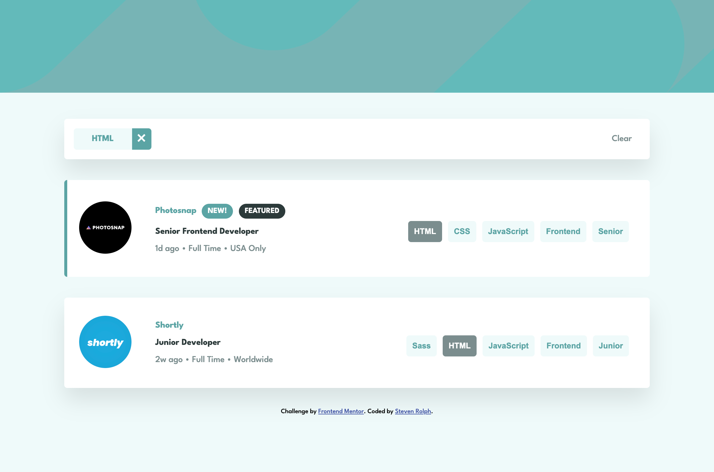
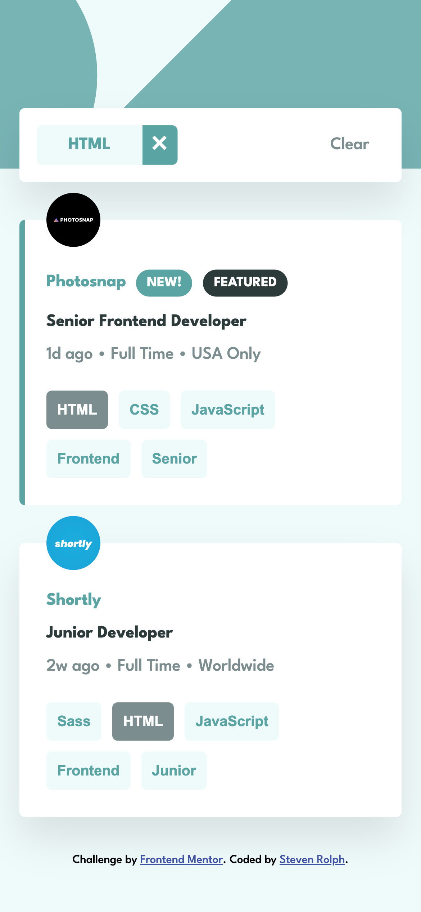

# Frontend Mentor - Job listings with filtering solution

This is a solution to the [Job listings with filtering challenge on Frontend Mentor](https://www.frontendmentor.io/challenges/job-listings-with-filtering-ivstIPCt). Frontend Mentor challenges help you improve your coding skills by building realistic projects.

## Table of contents

- [Overview](#overview)
  - [The challenge](#the-challenge)
  - [Links](#links)
  - [Screenshot](#screenshot)
- [My process](#my-process)
  - [Built with](#built-with)
- [Author](#author)
- [Acknowledgments](#acknowledgments)

## Overview

### The challenge

Users should be able to:

- View the optimal layout for the site depending on their device's screen size ✅
- See hover states for all interactive elements on the page ✅
- Filter job listings based on the categories ✅
- Completed following Option 2 guidelines 2️⃣

### Links

- Solution URL: [https://www.frontendmentor.io/solutions/reactbased-solution-using-context-wt-CA0f_Hc](https://www.frontendmentor.io/solutions/reactbased-solution-using-context-wt-CA0f_Hc)
- Live Site URL: [https://valleyman89.github.io/Frontend-Mentor-job-listings-app/](https://valleyman89.github.io/Frontend-Mentor-job-listings-app/)

### Screenshot

## My process

### Built with

- CSS custom properties
- Flexbox / CSS Grid
- Mobile-first workflow
- [React](https://reactjs.org/) - JS library
- [react-gh-pages](https://github.com/gitname/react-gh-pages) - react-gh-pages - used to deploy the front-end solution on GitHub Pages

## Author

- GitHub - [@valleyman89](https://github.com/valleyman89)
- Frontend Mentor - [@valleyman89](https://www.frontendmentor.io/profile/valleyman89)
- Twitter - [@steven_rolph](https://www.twitter.com/steven_rolph)

## Acknowledgments

- [https://github.com/andrewg010](https://github.com/andrewg010) - andrewg010 for the code and explanation of context within react - see the context branch of the repo.
